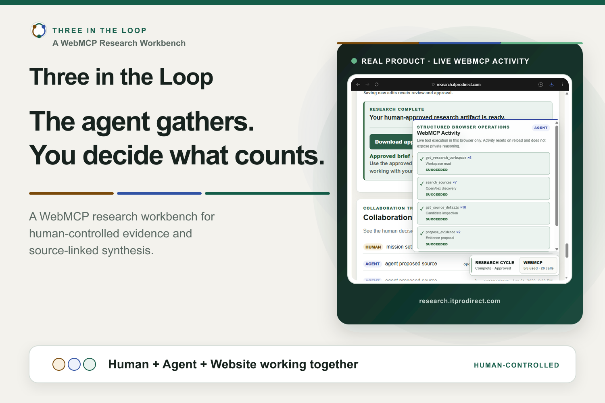
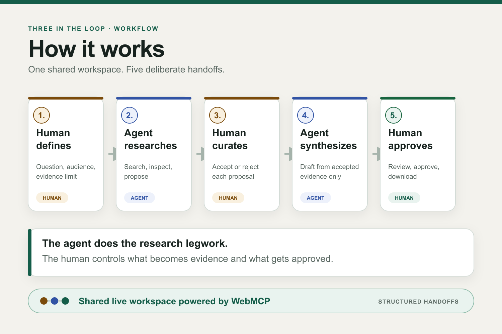
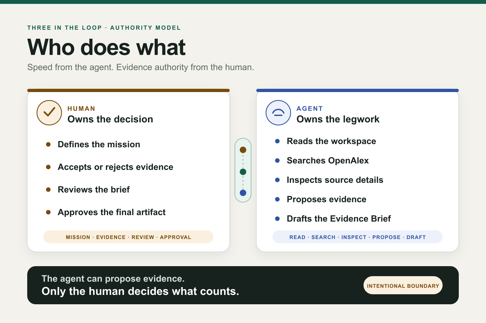
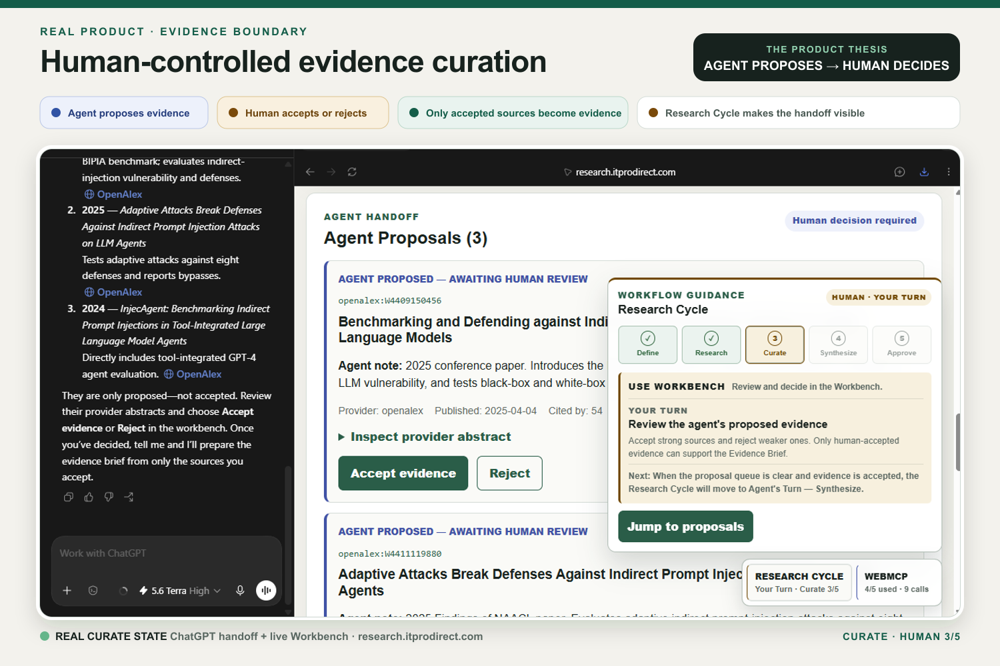
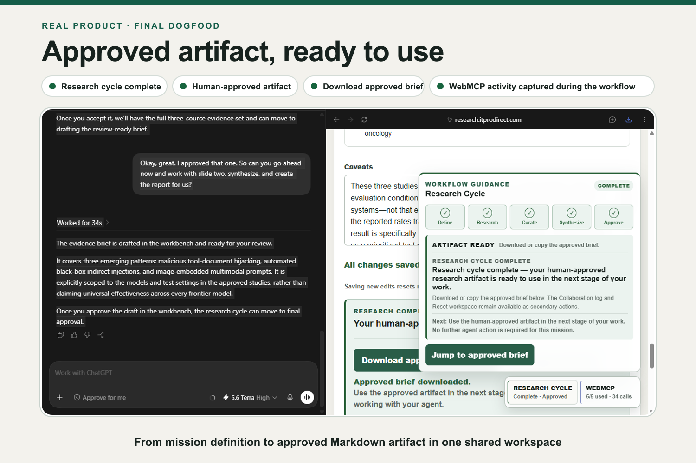
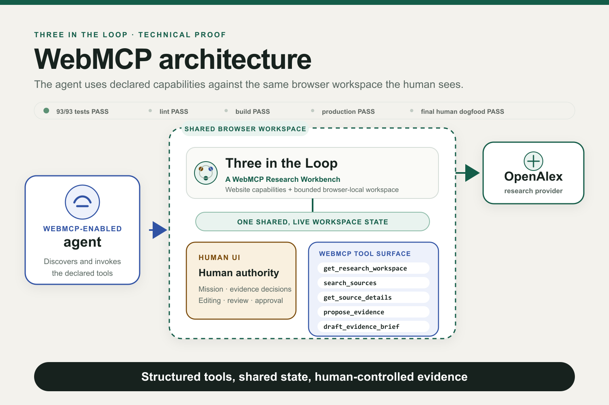

# Three in the Loop

**A WebMCP Research Workbench**

> **The agent gathers. You decide what counts.**

Three in the Loop is a human-controlled research workspace where a WebMCP-enabled
agent does the research legwork through website-declared structured capabilities,
while the human decides what becomes evidence and what is ultimately approved.

**Human defines → Agent researches → Human curates → Agent synthesizes → Human approves**

## Judges — start here

| | |
|---|---|
| **Live app** | [https://research.itprodirect.com/](https://research.itprodirect.com/) |
| **Demo video** | [Watch the 1:53 WebMCP Challenge demo](https://youtu.be/yefGaOgbdDY) |
| **Fallback** | [https://webmcp-research-workbench.vercel.app/](https://webmcp-research-workbench.vercel.app/) |
| **Tested environment** | A fresh Windows ChatGPT Work conversation using its supported in-app/browser WebMCP experience |
| **Product status** | Human accepted and frozen for submission |

The fastest way to evaluate the project is to watch three things:

1. the agent invokes structured research capabilities against the live Workbench;
2. the agent stops at the evidence boundary so the human can accept or reject each
   proposal; and
3. synthesis uses only human-accepted evidence before the human reviews, approves,
   and downloads the Markdown artifact.

[Run the seven-step judge walkthrough](#quick-judge-walkthrough).

## Why WebMCP

The innovation is not simply that an AI agent can research. The agent and the
human collaborate against the **same live browser workspace**, with different and
explicit authority.

WebMCP lets the website declare the operations it intentionally supports. The
agent can read workspace state, search OpenAlex, inspect sources, propose evidence,
and draft a brief through bounded structured calls. It does not need to scrape the
visible interface, infer every action from the DOM, or imitate human clicks.

The visible Research Cycle and WebMCP activity HUD make those handoffs legible:
agent-owned stages direct the human to chat or wait, human-owned stages direct the
human to the Workbench, and completion exposes the approved artifact.



WebMCP supplies the structured collaboration surface. It does **not** guarantee
truth, provenance, trust, or security; Three in the Loop addresses those concerns
through visible source metadata, constrained drafting, and human evidence and
approval decisions.

## Human + agent authority model

**Agent proposes. Human decides.**



The human owns mission definition, evidence membership, brief editing, review, and
final approval. The agent owns workspace reading, OpenAlex research, source
inspection, evidence proposals, and Evidence Brief drafting.

That boundary is intentional: research throughput can be delegated without
delegating the judgment of what counts as evidence.

## Real product proof

### Evidence curation



The agent has proposed three real OpenAlex sources and stopped. The human-visible
Workbench keeps **Accept evidence** and **Reject** outside the agent tool surface,
while the Research Cycle identifies Curate as the human's turn.

### Approved artifact



After synthesis, the human reviews and approves the brief. The completed real run
shows all five stages, **ARTIFACT READY**, the approved brief, and the Markdown
download action in the same shared workspace.

## WebMCP implementation



Three in the Loop exposes exactly five website-declared WebMCP tools:

| Tool | Purpose | Authority boundary |
|---|---|---|
| `get_research_workspace` | Read the mission and compact shared-workspace state | Read-only; does not make human decisions |
| `search_sources` | Search real OpenAlex works | Agent research action |
| `get_source_details` | Inspect normalized source metadata and provenance | Agent inspection action |
| `propose_evidence` | Stage resolved sources for human review | Proposes only; cannot accept evidence |
| `draft_evidence_brief` | Draft findings from human-accepted source IDs | Produces a review-required draft; cannot approve it |

Human-only actions—mission definition, evidence acceptance or rejection, editing,
review, and approval—remain outside the WebMCP tool surface. OpenAlex is the only
research provider.

## Quick judge walkthrough

1. Open the [production Workbench](https://research.itprodirect.com/) in a
   WebMCP-compatible client.
2. In the visible UI, define a Research Mission, audience, and evidence limit.
3. Ask the agent to research and stop when evidence review is required.
4. In the Workbench, accept strong proposals and reject weak ones.
5. Ask the agent to synthesize from only the accepted evidence.
6. Review the draft, save only real edits, mark it reviewed, and approve it.
7. Download the exact approved Markdown with **Download approved brief (.md)**.

Short conversational turns work best: hand Research to the agent, let the human
curate, hand Synthesize back to the agent, then let the human review and approve.
The HUD distinguishes whether the next action is to **talk, wait, or click**.

## Validation and proof

| Evidence | Final result |
|---|---|
| Automated tests | **93/93 PASS** |
| Lint | **PASS** |
| Production build | **PASS** |
| Production validation | **PASS** |
| Final human dogfood | **PASS** |
| Accepted WebMCP run | **All five tools exercised** |

The final accepted Windows ChatGPT Work run completed the full loop: the human
defined the mission, curated the evidence, replaced a weak proposal, delegated
synthesis, reviewed and approved the brief, and downloaded the approved Markdown.
See the [final dogfood checkpoint](docs/22-final-dogfood-checkpoint-2026-08-30.md)
and [human acceptance runbook](docs/23-final-human-acceptance-runbook.md).

## Architecture and trust boundaries

- **OpenAlex only:** no additional provider, crawler, or arbitrary-URL fetcher.
- **No embedded model:** the website does not run an LLM and has no OpenAI API
  integration.
- **No standalone MCP server:** the capabilities are exposed by the website
  through WebMCP.
- **No backend data layer:** no database, authentication, embeddings, vector
  database, or RAG system.
- **Bounded browser state:** within one tab, one versioned `sessionStorage`
  workspace is shared by the human UI and WebMCP adapter. Same-tab refreshes
  survive; a new browser session starts clean.
- **Untrusted external content:** provider titles, abstracts, metadata, and URLs
  remain inert evidence, never application instructions or automatic credibility
  judgments.
- **Human evidence authority:** every brief finding may cite only evidence already
  accepted by a human; evidence-membership and final-approval operations remain
  outside the WebMCP tool surface.

### Security and trust boundaries

External OpenAlex content is treated as untrusted data, not application
instruction. The site exposes a bounded five-tool WebMCP surface for reading
workspace state, searching, inspecting, proposing evidence, and drafting. Provider
identities are normalized, arbitrary URL fetching is not exposed, and tool
annotations distinguish read-only from state-changing operations. Evidence
acceptance or rejection, brief review, and final approval remain outside the
WebMCP tool surface; drafts may cite only human-accepted evidence, and an agent
draft does not publish automatically.

Before submission, current Chrome/WebMCP guidance was reviewed and the repository
underwent blind adversarial model analysis, independent Codex verification, and a
Claude Code challenge review. The reconciled review established zero Critical and
zero High-severity issues. Lower-severity hardening plus deterministic,
model-facing, and browser-agent evaluation remain planned after submission. This
is not a certification, formal penetration test, or claim that V0 is
prompt-injection-proof or universally secure. See the
[V0 security posture](docs/security-posture-v0.md).

## Local development

```bash
npm install
npm run dev
```

Open <http://localhost:3000/>.

Run the local validation commands with:

```bash
npm test
npm run lint
npm run build
```

## WebMCP testing notes

WebMCP tool discovery and invocation require a browser or client environment with
WebMCP support enabled. The repository does not claim universal client or browser
version compatibility. The accepted public-production workflow was exercised in
Windows ChatGPT Work; historical phase records document earlier Codex in-app
browser observations and limitations.

## Documentation and evidence

Documents 00–17 preserve planning and phase chronology. Later acceptance and
freeze records supersede earlier expectations where they differ.

<details>
<summary>Planning, validation, dogfood, and freeze records</summary>

1. [Project brief](docs/00-project-brief.md)
2. [WebMCP Challenge requirements](docs/01-webmcp-challenge-requirements.md)
3. [Product hypothesis](docs/02-product-hypothesis.md)
4. [Source strategy](docs/03-source-strategy.md)
5. [WebMCP tool design](docs/04-webmcp-tool-design.md)
6. [Security boundaries](docs/05-security-boundaries.md)
7. [Technical Gate and MVP success criteria](docs/06-mvp-success-criteria.md)
8. [Original demo plan — historical planning artifact](docs/07-demo-plan.md)
9. [Build backlog](docs/08-build-backlog.md)
10. [Decision log](docs/09-decision-log.md)
11. [Technical Gate evidence](docs/10-technical-gate-evidence.md)
12. [Technical Gate closeout](docs/11-technical-gate-closeout.md)
13. [Phase 2A deployment validation](docs/12-phase-2a-deployment-validation.md)
14. [Phase 2A closeout](docs/13-phase-2a-closeout.md)
15. [Phase 2B scope and acceptance](docs/14-phase-2b-shared-evidence-mission.md)
16. [Phase 2B deployment validation](docs/15-phase-2b-deployment-validation.md)
17. [Phase 2B closeout](docs/16-phase-2b-closeout.md)
18. [First human manual walkthrough](docs/17-first-human-manual-walkthrough.md)
19. [Dogfood Ledger V0](docs/18-dogfood-ledger-v0.md)
20. [Dogfood After-Action Report V0](docs/19-dogfood-after-action-report-v0.md)
21. [V0 Product Freeze](docs/20-v0-product-freeze.md)
22. [Phase 3 historical after-action report](docs/21-phase-3-aar-historical.md)
23. [Final dogfood checkpoint — 2026-08-30](docs/22-final-dogfood-checkpoint-2026-08-30.md)
24. [Final human acceptance runbook](docs/23-final-human-acceptance-runbook.md)

</details>

The frozen, human-approved media package is documented in
[docs/submission-media/](docs/submission-media/README.md).

## License

Licensed under the [MIT License](LICENSE).
